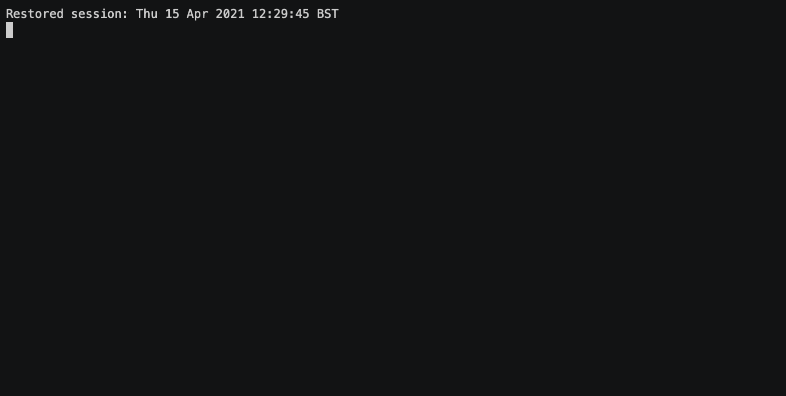

# dbt2looker

Use `dbt2looker` to generate Looker view files automatically from dbt models.

**Features**

* Auto-generates a Looker view per dbt model
* Supports dbt model and column-level descriptions
* Automatically maps raw column types to looker types
* Creates dimension groups for datetime/timestamp/date types
* Currently supports: BigQuery (snowflake, postgres to come)

[](https://asciinema.org/a/407407)

### Usage

Run `dbt2looker` in the root of your dbt project after compiling looker docs.

**Generate Looker view files for all models:**
```shell
dbt compile
dbt docs generate
dbt2looker
```

**Generate Looker view files for all models tagged `prod`**
```shell
dbt2looker --tag prod
```

## Install

**Install from PyPi repository**

Install from pypi into a fresh virtual environment.

```
# Create virtual env
python3.7 -m venv dbt2looker-venv
source dbt2looker-venv/bin/activate

# Install
pip install dbt2looker

# Run
dbt2looker
```

**Build from source**

Requires [poetry](https://python-poetry.org/docs/) and python >=3.7

```
# Install
poetry install

# Run
poetry run dbt2looker
```